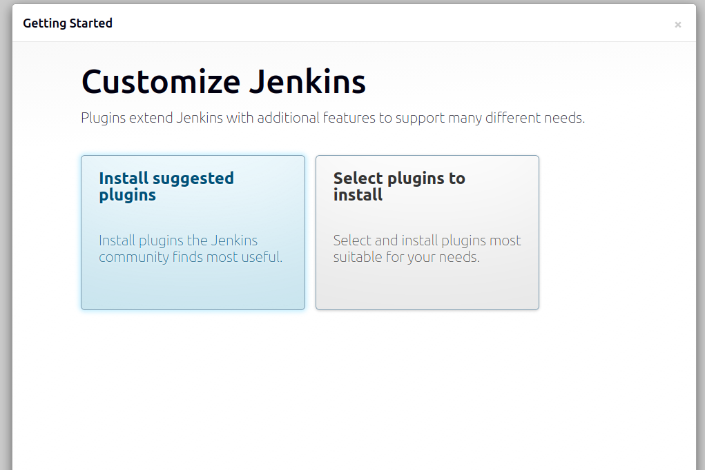
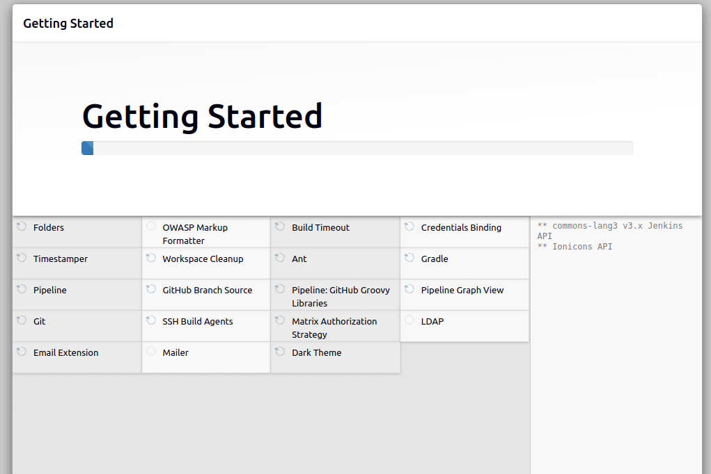

# Server Setup: 
Install Jenkins on Ubuntu 
### 1. Install Java (required)
```bash
sudo apt update
sudo apt install -y openjdk-17-jdk
java -version # check version

```

### 2. Install Jenkins:
```bash
# Create a keyrings directory if it doesn't exist
sudo mkdir -p /etc/apt/keyrings

# Download and install Jenkins GPG key properly
curl -fsSL https://pkg.jenkins.io/debian-stable/jenkins.io-2023.key \
| sudo tee /etc/apt/keyrings/jenkins-keyring.asc > /dev/null

# Add the Jenkins repo using signed-by
echo "deb [signed-by=/etc/apt/keyrings/jenkins-keyring.asc] https://pkg.jenkins.io/debian-stable binary/" \
| sudo tee /etc/apt/sources.list.d/jenkins.list

# Install and start Jenkins
sudo apt update
sudo apt install -y jenkins
sudo systemctl enable jenkins
sudo systemctl start jenkins
sudo systemctl status jenkins

# access jenkin password:
sudo cat /var/lib/jenkins/secrets/initialAdminPassword
# output 

a56566c6a8d1457d9e9d2e836ee7dd12

# allow port if not
sudo ufw allow 8080

# open in Browser:
http://localhost:8080

```

```bash
# add your password : mine is this 
a56566c6a8d1457d9e9d2e836ee7dd12
```
### Finish Setup

#### 1.  Click Install suggested plugins



#### 2. Create admin user
user: admin
password: admin123
name : danish ammar
email: danishammar112233@gmail.com

- Save & Finish